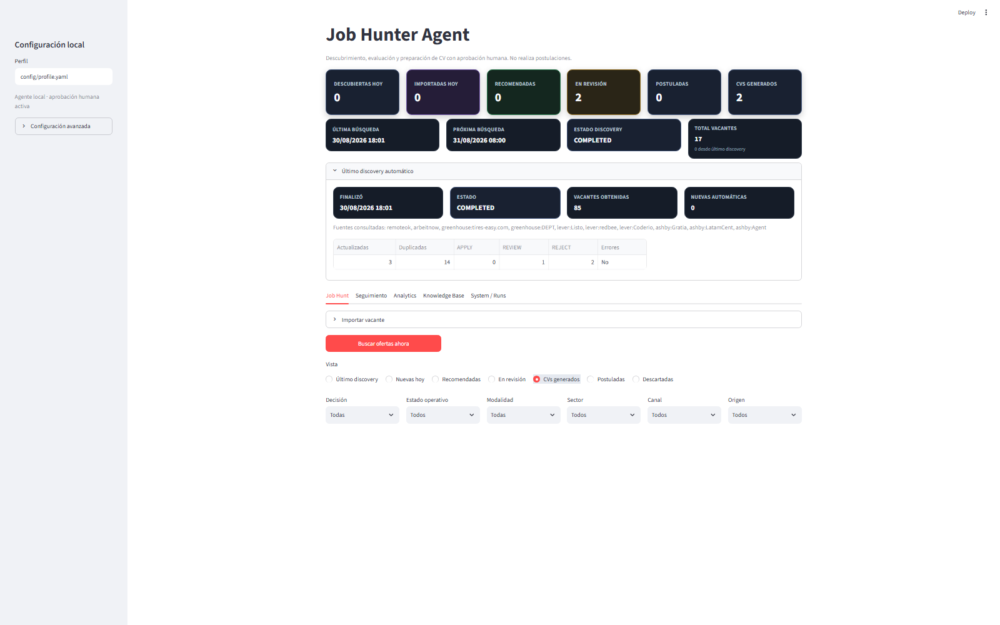
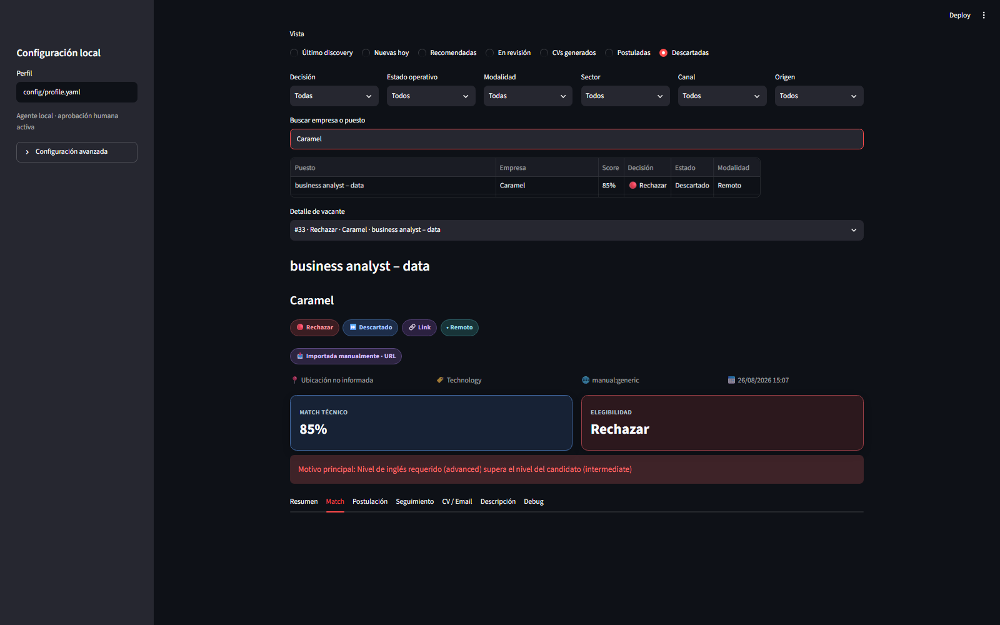
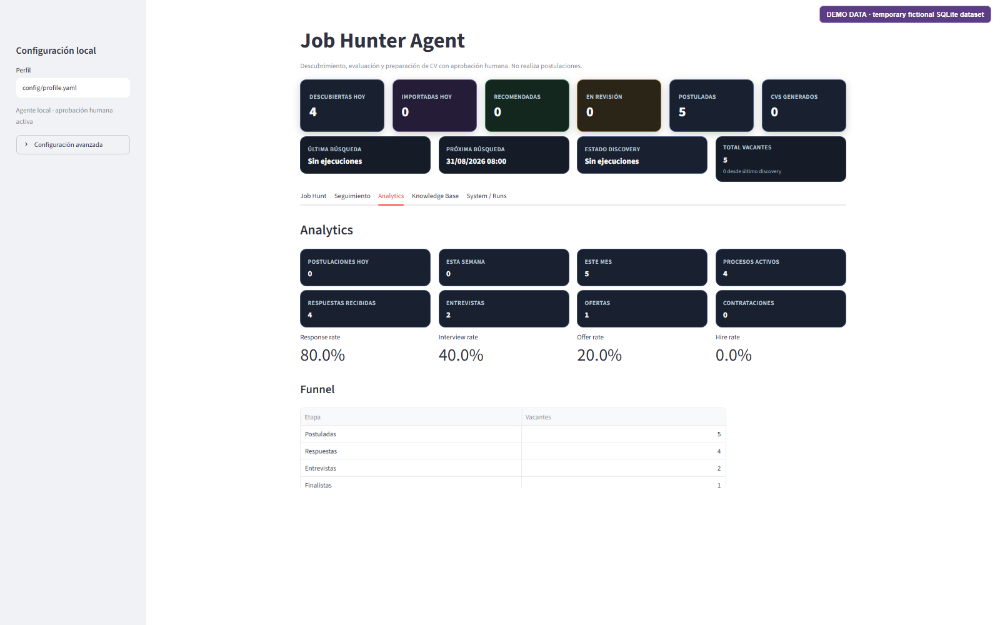
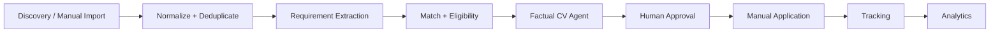

<div align="center">

# 🔎 Job Hunter Agent

### Local-First Job Search Automation with Factual CV Adaptation & Human-in-the-Loop Control

**Python · Streamlit · SQLite · Automation · Gmail Drafts · Analytics**

</div>

---

## 🎯 Executive Summary

**Job Hunter Agent** is a local-first data product for managing and automating a modern job search without giving up human control.

It combines public-source discovery, requirement-aware evaluation, factual CV adaptation, approval-gated Gmail drafts, application tracking and conversion analytics in one workflow.

The project treats job hunting as a structured data problem:

> **discover → normalize → evaluate → prepare → approve → apply → track → learn**

The goal is not to auto-apply everywhere. The goal is to automate repetitive work while keeping sensitive or judgment-heavy decisions explicitly human.

---

## 📊 Portfolio Highlights

| Capability | Result |
|---|---:|
| 🧪 Automated tests | **330+ local tests** |
| 🌐 Discovery | **Multiple public APIs, ATS feeds & career pages** |
| 📄 CV generation | **ATS-friendly, factual, max 2 pages** |
| 🧠 Decision model | **Technical match separated from eligibility** |
| ✉️ Gmail integration | **Approval-gated draft creation** |
| 📈 Tracking | **Stage history + funnel + conversion analytics** |
| 🔐 Privacy model | **Local-first, private runtime data ignored by Git** |

---

## 🧩 What the Product Does

Job Hunter Agent connects the full application workflow:

- discovers jobs from multiple public sources,
- normalizes and deduplicates opportunities,
- evaluates technical fit and hard eligibility separately,
- generates role-aware CVs from verified facts only,
- detects application channels,
- prepares Gmail drafts behind explicit approval,
- tracks recruitment stages and next actions,
- measures response, interview, offer and hire conversion.

It is designed as an operational system, not just a scraper or scoring notebook.

---

## 🧠 Match vs Eligibility

A key design choice is to keep **technical fit** and **eligibility** separate.

A role can be a strong technical match and still be a bad application target.

```text
Technical match: 85%
Eligibility:      REJECT
Reason:           Advanced English required
```

This distinction prevents a misleading score from hiding hard constraints.

### Current eligibility checks include

- unsupported seniority,
- excessive required years of experience,
- English above the configured factual level,
- explicit geography or location constraints.

The final decision can be:

```text
APPLY
REVIEW
REJECT
```

while the technical score remains visible and explainable.

---

## 👤 Human-in-the-Loop by Design

This project intentionally **does not** remove the user from high-impact decisions.

The system does not:

- submit job applications automatically,
- invent experience or achievements,
- inflate English level,
- mark a job as applied because a link was opened,
- change tracking stages silently,
- send Gmail messages.

The user explicitly reviews or approves:

- generated CVs,
- email content,
- Gmail draft creation,
- application submission state,
- recruitment-stage changes.

> Human approval is a product requirement, not a missing feature.

---

## 🔄 End-to-End Workflow

```text
Public Sources / Manual Import
          ↓
Normalize + Deduplicate
          ↓
Requirement Extraction
          ↓
Technical Match + Eligibility
          ↓
Human Review
          ↓
Factual CV Generation
          ↓
Approval
          ↓
Manual Application
          ↓
Tracking
          ↓
Conversion Analytics
```

---

## 🌐 Discovery Layer

The discovery system supports multiple public sources and keeps source failures isolated.

### Sources

- RemoteOK
- Arbeitnow
- Greenhouse
- Lever
- Ashby
- Workable
- SmartRecruiters
- Recruitee
- career pages exposing JSON-LD `JobPosting`

### Discovery quality controls

- configurable target roles,
- configurable companies,
- query filters,
- freshness filters,
- geography checks,
- URL and fingerprint deduplication,
- source latency and error metrics,
- duplicate-rate tracking,
- source-origin visibility.

The dashboard preserves whether a job originally came from:

- automatic discovery,
- manual URL import,
- pasted text,
- manual form,
- unknown legacy origin.

---

## 📄 Factual CV Architecture

The private factual master CV is the system's source of truth.

```text
private/master_cv.yaml
        ↓
Verified facts
        ↓
Role-aware selection
        ↓
AdaptedCV
        ↓
Validation
        ↓
HTML Preview + PDF
```

Every generated bullet references one or more:

```text
source_fact_ids
```

Those IDs must resolve to factual entries in the master CV before rendering.

This prevents the CV agent from introducing unsupported:

- employers,
- tools,
- courses,
- projects,
- responsibilities,
- achievements.

The same validated model generates both HTML and PDF output.

### CV output rules

- ATS-friendly
- selectable text
- maximum **2 pages**
- minimum **9.5 pt** body text
- Windows-safe filenames
- PDF validity checks before application workflows are enabled

---

## ✉️ Application & Gmail Draft Flow

The application layer detects:

```text
LINK
EMAIL
LINK_EMAIL
UNKNOWN
```

For email applications, the tool can prepare a Gmail draft only after explicit approval.

```text
GENERATED
    ↓
APPROVED
    ↓
GMAIL_DRAFT_CREATED
```

Real sending is intentionally disabled.

Creating a Gmail draft **does not** mark the application as submitted.

The integration uses Gmail OAuth with the `gmail.compose` scope and does not use passwords or SMTP.

---

## 📈 Application Tracking

Job Hunter Agent keeps operational status and recruitment stage separate.

Tracked stages can include:

```text
NOT_APPLIED
APPLIED
RECRUITER_CONTACT
HR_INTERVIEW
TECH_INTERVIEW
ASSESSMENT
FINAL_INTERVIEW
OFFER
HIRED
REJECTED
WITHDRAWN
NO_RESPONSE
```

Every stage change is appended to history with:

- timestamp,
- optional note,
- next-action date,
- next-action note.

Corrections create a new event rather than silently deleting history.

This keeps the process auditable.

---

## 📊 Conversion Analytics

The analytics layer measures the actual performance of the job search.

### Metrics

- response rate,
- interview rate,
- offer rate,
- hire rate,
- application funnel,
- daily and weekly application volume,
- performance by role family,
- performance by source,
- performance by channel,
- performance by match-score bucket,
- time to first response,
- time from application to HR interview.

Historical conversion is **descriptive only**.

It does not automatically change technical scoring or reject future roles.

---

## 🖥️ Dashboard

### Job Hunt Dashboard



### Match vs Eligibility



### Application Analytics

The analytics screenshot uses a temporary fictional SQLite dataset.



---

## 🏗️ Architecture



### Local-first design

- SQLite stores operational state.
- `config/profile.yaml` remains local.
- `private/master_cv.yaml` remains local.
- Gmail credentials and OAuth tokens remain under `private/`.
- generated CVs remain under ignored `outputs/`.
- public repository content uses example configuration and fictional fixtures.

---

## 🔐 Privacy & Security

Private runtime data is deliberately excluded from the public repository.

- local SQLite databases are ignored,
- `private/` is ignored,
- generated CV outputs are ignored,
- Gmail passwords are never requested or stored,
- OAuth credentials stay local,
- discovery uses public APIs and public career endpoints,
- authenticated-page scraping is not used,
- CAPTCHA or anti-bot controls are not bypassed,
- LinkedIn login is not bypassed.

This project is built around public-source discovery and local personal data.

---

## 🛠️ Tech Stack

<p>
  
  
  
  
  
  
</p>

**Methods:** Data Product Design · Automation · Requirement Matching · Eligibility Rules · Human-in-the-Loop · Workflow Tracking · Funnel Analytics

---

## 🧪 Engineering Quality

- **330+ tests passing locally**
- unit tests
- integration tests
- migration tests
- UI regression tests
- isolated source failures
- immutable stage history
- factual provenance validation
- PDF validity checks
- guarded scheduler execution
- explicit application-state transitions

No public CI or coverage percentage is claimed because the repository currently has no published CI workflow or coverage report.

---

## 📂 Project Structure

```text
app/                    Streamlit dashboard and approval UI
config/                 Public examples and factual-data templates
scripts/                Windows scheduler installation and guarded runners
src/job_hunter/         Discovery, scoring, CV, Gmail, tracking and analytics
tests/                  Fictional tests and regression coverage
data/                   Public sample input; runtime databases ignored
docs/screenshots/       Public-safe screenshots
```

---

## ▶️ Run Locally

### Requirements

- Python 3.11+
- Windows PowerShell for the commands below
- SQLite included with Python

### Install

```powershell
git clone https://github.com/GabArg/job-hunter-agent.git
cd job-hunter-agent

python -m venv .venv
.venv\Scripts\Activate.ps1

python -m pip install -e ".[dev]"

Copy-Item config/profile.example.yaml config/profile.yaml

streamlit run app/streamlit_app.py
```

Create a local factual CV:

```powershell
New-Item -ItemType Directory -Force private
Copy-Item config/master_cv.example.yaml private/master_cv.yaml
```

Never commit the private copy.

---

## 🧭 Useful Commands

```powershell
# Discovery
python -m job_hunter.cli discover --query "Data Analyst" --limit 10
python -m job_hunter.cli discover --source remoteok --query "Business Analyst" --limit 5

# CV generation
python -m job_hunter.cli generate-cv 123 --master-cv private/master_cv.yaml

# Tracking
job-hunter tracking-summary
job-hunter set-stage 123 HR_INTERVIEW --note "Fictional local note"
job-hunter application-history 123

# Tests
pytest
```

---

## ⏰ Scheduler

The default Windows scheduler uses two local slots:

```text
08:00
18:00
```

Install them explicitly:

```powershell
powershell -ExecutionPolicy Bypass -File scripts/install_windows_tasks.ps1
```

The installer creates:

```text
JobHunter-Morning
JobHunter-Evening
```

The runner uses:

- repository-root resolution,
- `.venv` activation,
- discovery locking,
- single-instance execution,
- ignored local logs.

Run the guarded workflow manually with:

```powershell
powershell -ExecutionPolicy Bypass -File scripts/run_discovery.ps1 -Slot manual
```

Task installation is never triggered automatically by the application or tests.

---

## ⚠️ Current Limitations

- Not a hosted SaaS product.
- No automatic application submission.
- Gmail sending is disabled.
- Match quality depends on extracted requirements and factual profile configuration.
- Some career pages may change their public structure.
- Analytics become more useful as more real tracking history accumulates.
- No public CI or published coverage report is currently claimed.

---

## 🚀 Potential Next Steps

- Measure weekday discovery precision and source health.
- Tune source queries using observed false positives and duplicates.
- Improve conversion analytics with more tracking history.
- Add optional local notifications for next actions.
- Improve role-family and source performance analysis.
- Explore an explicitly reviewed feedback loop for ranking improvements.
- Add public CI when the workflow is stable.

Automatic application submission remains intentionally out of scope.

---

## 👤 Author

**Guido Arturo Broccoli**

[LinkedIn](https://www.linkedin.com/in/guido-a-broccoli) ·
[GitHub](https://github.com/GabArg) ·
[Repository](https://github.com/GabArg/job-hunter-agent)

