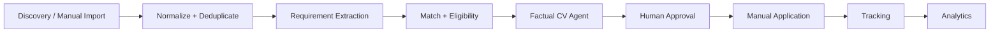

# Job Hunter Agent

**Local job-search automation with factual CV adaptation, eligibility checks, and human-in-the-loop application tracking.**

[](https://www.python.org/)
[](https://streamlit.io/)


Job Hunter Agent is a local-first system for organizing and automating a job search without giving up human control. It combines public-source discovery, manual imports, requirement-aware evaluation, evidence-constrained CV generation, approval-gated Gmail drafts, application tracking, and conversion analytics in one Streamlit dashboard.

- Discover jobs from multiple public APIs, ATS feeds, and structured career pages.
- Normalize, deduplicate, and evaluate requirements separately from eligibility.
- Generate role-aware, ATS-friendly CVs using factual evidence only.
- Detect application channels and prepare Gmail drafts behind explicit approval.
- Track application stages, next actions, and immutable transition history.
- Analyze response, interview, offer, and hire conversion without changing scoring decisions.

> The main documentation is currently in English for portfolio use. Spanish documentation may be added later.

## Contents

- [Why this project exists](#why-this-project-exists)
- [Screenshots](#screenshots)
- [Technical Match vs Eligibility](#technical-match-vs-eligibility)
- [Human-in-the-loop by design](#human-in-the-loop-by-design)
- [Features](#features)
- [Architecture](#architecture)
- [Factual CV architecture](#factual-cv-architecture)
- [Workflow](#workflow)
- [Quick Start](#quick-start)
- [Scheduler](#scheduler)
- [Privacy & Security](#privacy--security)
- [Project Structure](#project-structure)
- [Current Status](#current-status)
- [Roadmap](#roadmap)

## Why this project exists

A real job search is a data workflow: opportunities arrive from heterogeneous sources, descriptions use inconsistent terminology, eligibility constraints can override a strong technical match, and every application creates follow-up state.

This project treats that workflow as a local data product. Python services handle ingestion, normalization, semantic matching, scoring, document generation, OAuth integration, and analytics; Streamlit provides an operational UI; SQLite preserves auditable state. The result is automation where it is useful and explicit approval where judgment matters.

## Screenshots

Screenshots are intentionally not embedded until reviewed, public-safe images are versioned. This avoids broken images and accidental publication of private job-search data.

Planned public assets:

| View | Expected asset |
|---|---|
| Main dashboard and discovery summary | `docs/screenshots/dashboard.png` |
| Job detail: technical match and eligibility | `docs/screenshots/job-detail.png` |
| Application tracking and analytics | `docs/screenshots/tracking-analytics.png` |

See [`docs/screenshots/README.md`](docs/screenshots/README.md) for the publication checklist.

## Technical Match vs Eligibility

Technical match and eligibility are deliberately separate dimensions.

```text
Technical match: 85%
Eligibility:      REJECT
Reason:           Advanced English required; candidate profile is intermediate.
```

The technical score can remain high because the candidate matches the role's tools and responsibilities. A hard eligibility rule still takes precedence over that score. Current hard-reject checks include:

- unsupported seniority;
- excessive required years of experience;
- required English above the configured factual level;
- explicit geography or location constraints.

`APPLY`, `REVIEW`, and `REJECT` therefore describe the combined outcome, while the dashboard keeps the technical score visible and explains the primary eligibility reason.

## Human-in-the-loop by design

The system does **not**:

- submit job applications automatically;
- invent experience, employers, technologies, or achievements;
- inflate or rewrite the candidate's English level;
- mark a job as applied because a link was opened;
- change application tracking stages without an explicit action;
- send Gmail messages.

The user explicitly reviews or approves:

- the generated CV;
- email content;
- Gmail draft creation;
- marking an application as submitted;
- every recruitment-stage transition or correction.

This boundary is a product requirement, not a missing automation feature.

## Features

### Discovery

- RemoteOK and Arbeitnow public feeds.
- Public ATS integrations: Greenhouse, Lever, Ashby, Workable, SmartRecruiters, and Recruitee.
- Generic career pages exposing JSON-LD `JobPosting` data.
- Configurable target roles, companies, queries, freshness, and geography checks.
- URL/fingerprint deduplication and isolated source failures.
- Source health, latency, relevance, duplicate, and error metrics.
- Windows scheduler slots at 08:00 and 18:00 local time.
- Clear origin visibility: automatic discovery, manual URL, pasted text, manual form, or unknown legacy origin.

### Evaluation

- Bilingual semantic matching and canonical requirement concepts.
- Capability evidence derived from the factual master CV.
- Independent technical score and eligibility evaluation.
- Hard rejects for seniority, experience, English level, and explicit location constraints.
- Explainable `APPLY`, `REVIEW`, and `REJECT` decisions with matched requirements and evidence.

### CV Agent

- A private factual master CV as the single source of truth.
- Auditable `source_fact_ids` on generated bullets.
- Role-aware selection and light semantic skill deduplication.
- Windows-safe professional filenames: `<Candidate>_CV_<Role>_<Company>.pdf`.
- ATS-friendly PDF with selectable text, a maximum of two pages, and a 9.5 pt minimum body size.
- HTML preview/debug output generated from the same validated CV model.
- PDF validity, page-count, and text checks before application workflows are enabled.

### Applications

- `LINK`, `EMAIL`, `LINK_EMAIL`, and `UNKNOWN` channel detection.
- Recruiting-email and application-instruction extraction.
- Explicit channel selection for mixed application paths.
- Gmail OAuth Desktop flow using the `gmail.compose` scope.
- Approval-gated lifecycle: `GENERATED -> APPROVED -> GMAIL_DRAFT_CREATED`.
- Real Gmail sending is intentionally disabled.

### Tracking

- Separate operational status and recruitment-stage models.
- Stages from `NOT_APPLIED` through recruiter contact, interviews, assessment, offer, hire, rejection, withdrawal, or no response.
- Append-only stage history with timestamps and optional notes.
- Next-action date and note.
- Manual correction through a new history event rather than silent deletion.
- Timeline view and no-response/follow-up indicators.

### Analytics

- Response, interview, offer, and hire rates.
- Application funnel from submission through hire.
- Daily and weekly application metrics.
- Performance by role family, source, channel, and match-score bucket.
- Time to first response and time from application to HR interview.
- Descriptive analytics only: historical conversion never changes scoring or rejects a role.

## Architecture



The application is local-first:

- SQLite stores jobs, discovery runs, import history, email state, tracking history, and analytics inputs.
- `config/profile.yaml` and `private/master_cv.yaml` are local runtime files ignored by Git.
- Gmail client secrets and OAuth tokens remain under `private/`.
- Generated CVs remain under ignored `outputs/` directories.
- The public repository contains example configuration, application code, and fictional test fixtures—not private runtime data.

## Factual CV architecture

`private/master_cv.yaml` is the private factual source of truth. It is created locally from the public example and is never committed.

Every selected bullet:

1. references one or more `source_fact_ids`;
2. must resolve to facts in the loaded master CV;
3. passes a validator before rendering;
4. cannot introduce an unsupported employer, technology, course, project, or claim.

The same validated `AdaptedCV` drives the HTML preview and PDF renderer. This makes factual provenance a structural constraint rather than a prompt convention.

## Workflow

```text
Discover or import
    -> Normalize and deduplicate
    -> Evaluate technical match and eligibility
    -> Human review
    -> Generate and validate CV
    -> Approve application material
    -> Apply manually
    -> Track stages and next actions
    -> Analyze conversion
```

An `APPLY` decision is a recommendation to review and prepare an application. It never means auto-submit.

### Discovery origin visibility

The dashboard distinguishes jobs initially created by:

- automatic discovery;
- manual public-URL import;
- pasted-text import;
- manual form;
- unknown legacy origin.

If discovery later finds a manually imported job, deduplication preserves the original job ID and initial manual origin while recording enough source metadata to recognize the later automatic encounter. Scheduler quality can therefore be evaluated without mixing in manual research.

## Quick Start

### Requirements

- Python 3.11+
- Windows PowerShell for the commands below
- SQLite, included with Python

### Install and run

```powershell
git clone https://github.com/GabArg/job-hunter-agent.git
cd job-hunter-agent

python -m venv .venv
.venv\Scripts\Activate.ps1
python -m pip install -e ".[dev]"

Copy-Item config/profile.example.yaml config/profile.yaml
streamlit run app/streamlit_app.py
```

For local CV generation, create a private working copy of the factual example and replace only its fictional/example content with reviewed facts:

```powershell
New-Item -ItemType Directory -Force private
Copy-Item config/master_cv.example.yaml private/master_cv.yaml
```

Never commit the private copy.

### Useful commands

```powershell
# Run public-source discovery
python -m job_hunter.cli discover --query "Data Analyst" --limit 10
python -m job_hunter.cli discover --source remoteok --query "Business Analyst" --limit 5

# Generate a validated HTML + PDF CV for a stored job
python -m job_hunter.cli generate-cv 123 --master-cv private/master_cv.yaml

# Inspect or update local application tracking
job-hunter tracking-summary
job-hunter set-stage 123 HR_INTERVIEW --note "Fictional local note"
job-hunter application-history 123

# Run the test suite
pytest
```

## Scheduler

The default local schedule uses two Windows Task Scheduler slots:

```text
08:00
18:00
```

Install them explicitly:

```powershell
powershell -ExecutionPolicy Bypass -File scripts/install_windows_tasks.ps1
```

The installer creates `JobHunter-Morning` and `JobHunter-Evening` with local time, `StartWhenAvailable`, and a single-instance policy. The runner resolves the repository root, activates `.venv` when present, uses a discovery lock, and writes ignored logs under `logs/discovery/`.

Run the same guarded workflow manually with:

```powershell
powershell -ExecutionPolicy Bypass -File scripts/run_discovery.ps1 -Slot manual
```

Task installation is never triggered by the application or tests.

## Gmail drafts

The Gmail integration requests only the official `https://www.googleapis.com/auth/gmail.compose` scope. It can create an explicitly approved draft with the validated PDF attached:

```text
GENERATED -> APPROVED -> GMAIL_DRAFT_CREATED
```

Real Gmail sending is intentionally disabled. The application does not use passwords or SMTP.

Local OAuth files belong only in:

```text
private/gmail/client_secret.json
private/gmail/token.json
```

Connect explicitly from `System / Runs` or with:

```powershell
python -m job_hunter.cli gmail-connect
python -m job_hunter.cli gmail-status
```

Creating a draft does not mark a job as applied.

## Privacy & Security

- `data/jobs.db` and other local SQLite files are ignored.
- `private/` is ignored, including profile data, factual CV data, Gmail credentials, and OAuth tokens.
- `outputs/` is ignored, including generated CVs.
- The application never requests or stores a Gmail password.
- Discovery uses public APIs, public ATS endpoints, and public structured career pages.
- It does not bypass LinkedIn login, scrape authenticated pages, solve CAPTCHAs, evade rate limits, or circumvent anti-bot controls.
- Notes and tracking data remain local; users should not store secrets in notes.

## Project Structure

```text
app/                    Streamlit dashboard and human approval UI
config/                 Public example profiles and factual-data templates
scripts/                Windows scheduler installation and guarded runners
src/job_hunter/         Domain logic, ingestion, scoring, CV, Gmail, tracking, and analytics
tests/                  Fictional unit, integration, migration, and UI regression tests
data/                   Public sample input; runtime SQLite files are ignored
docs/screenshots/       Checklist and future public-safe screenshots
```

## Current Status

- Local-first, production-like personal tool; not a hosted SaaS product.
- Active multi-source discovery and Windows scheduler support.
- Manual URL, pasted-text, and form imports.
- Requirement-aware scoring and hard eligibility checks.
- Validated ATS-friendly PDF generation.
- Approval-gated Gmail draft creation; sending disabled.
- Manual application tracking and conversion analytics.
- More than 330 tests passing locally.

No CI status or coverage percentage is claimed because the repository currently has no public CI workflow or published coverage report.

## Roadmap

- Observe weekday discovery precision and source health with real local runs.
- Tune discovery queries and target registries using measured false positives and duplicates.
- Improve conversion views as more tracking history becomes available.
- Add optional local notifications for next actions and stale applications.
- Explore a future, explicitly reviewed feedback loop without automatic rejection or auto-apply.

Automatic application submission is intentionally not on the roadmap.
